# CDK

Using CDK to deploy an AWS setup provided in [Lab Instruction](../instructions/lab_instruction.pdf) doc.

- initicated the setup with `cdk init`

- Created modules for deploying vpc, ec2, s3 and placed them in [intutiveinfra](intutiveinfra) folder.

- verified the setup with `cdk ls`
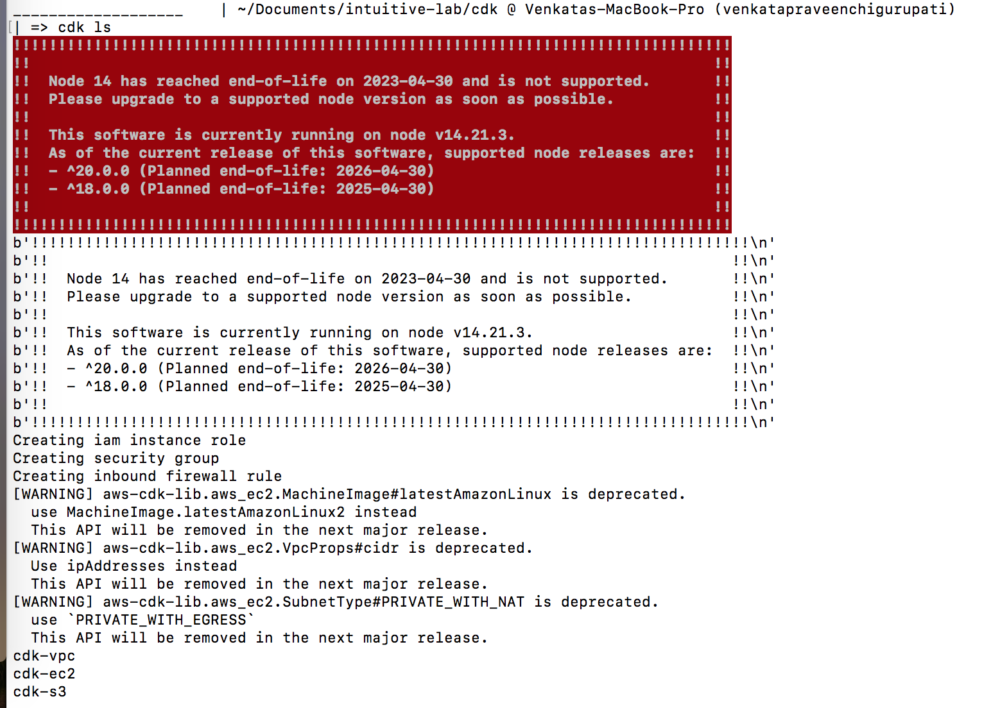

- bootstrapped the setup with `cdk bootstrap` and deployed it with `cdk deploy --all`
```
cdk deploy --all
!!!!!!!!!!!!!!!!!!!!!!!!!!!!!!!!!!!!!!!!!!!!!!!!!!!!!!!!!!!!!!!!!!!!!!!!!!!!!!!!
!!                                                                            !!
!!  Node 14 has reached end-of-life on 2023-04-30 and is not supported.       !!
!!  Please upgrade to a supported node version as soon as possible.           !!
!!                                                                            !!
!!  This software is currently running on node v14.21.3.                      !!
!!  As of the current release of this software, supported node releases are:  !!
!!  - ^20.0.0 (Planned end-of-life: 2026-04-30)                               !!
!!  - ^18.0.0 (Planned end-of-life: 2025-04-30)                               !!
!!                                                                            !!
!!!!!!!!!!!!!!!!!!!!!!!!!!!!!!!!!!!!!!!!!!!!!!!!!!!!!!!!!!!!!!!!!!!!!!!!!!!!!!!!
b'!!!!!!!!!!!!!!!!!!!!!!!!!!!!!!!!!!!!!!!!!!!!!!!!!!!!!!!!!!!!!!!!!!!!!!!!!!!!!!!!\n'
b'!!                                                                            !!\n'
b'!!  Node 14 has reached end-of-life on 2023-04-30 and is not supported.       !!\n'
b'!!  Please upgrade to a supported node version as soon as possible.           !!\n'
b'!!                                                                            !!\n'
b'!!  This software is currently running on node v14.21.3.                      !!\n'
b'!!  As of the current release of this software, supported node releases are:  !!\n'
b'!!  - ^20.0.0 (Planned end-of-life: 2026-04-30)                               !!\n'
b'!!  - ^18.0.0 (Planned end-of-life: 2025-04-30)                               !!\n'
b'!!                                                                            !!\n'
b'!!!!!!!!!!!!!!!!!!!!!!!!!!!!!!!!!!!!!!!!!!!!!!!!!!!!!!!!!!!!!!!!!!!!!!!!!!!!!!!!\n'
Creating iam instance role
Creating security group
Creating inbound firewall rule
[WARNING] aws-cdk-lib.aws_ec2.MachineImage#latestAmazonLinux is deprecated.
  use MachineImage.latestAmazonLinux2 instead
  This API will be removed in the next major release.
[WARNING] aws-cdk-lib.aws_ec2.VpcProps#cidr is deprecated.
  Use ipAddresses instead
  This API will be removed in the next major release.
[WARNING] aws-cdk-lib.aws_ec2.SubnetType#PRIVATE_WITH_NAT is deprecated.
  use `PRIVATE_WITH_EGRESS`
  This API will be removed in the next major release.
[Warning at /cdk-ec2/IntutiveASG] desiredCapacity has been configured. Be aware this will reset the size of your AutoScalingGroup on every deployment. See https://github.com/aws/aws-cdk/issues/5215 [ack: @aws-cdk/aws-autoscaling:desiredCapacitySet]

✨  Synthesis time: 7.18s

cdk-vpc
cdk-ec2:  start: Building 915643151e4948183dc24c2e374803814030a9dee94165973698e78b900e480a:current_account-current_region
cdk-ec2:  success: Built 915643151e4948183dc24c2e374803814030a9dee94165973698e78b900e480a:current_account-current_region
cdk-vpc: deploying... [1/3]

 ✅  cdk-vpc (no changes)

✨  Deployment time: 0.41s

Outputs:
cdk-vpc.ExportsOutputRefVPCB9E5F0B4BD23A326 = vpc-0aaa26cfee935b98c
cdk-vpc.ExportsOutputRefVPCPrivateSubnet1Subnet8BCA10E01F79A1B7 = subnet-0ce3f9052660c04e8
cdk-vpc.ExportsOutputRefVPCPrivateSubnet2SubnetCFCDAA7AB22CF85D = subnet-061222ee6822e21bf
cdk-vpc.Output = vpc-0aaa26cfee935b98c
Stack ARN:
arn:aws:cloudformation:us-east-2:361178673953:stack/cdk-vpc/bd5c15a0-53ec-11ee-b962-068253202677

✨  Total time: 7.6s

cdk-s3
cdk-ec2:  start: Publishing 915643151e4948183dc24c2e374803814030a9dee94165973698e78b900e480a:current_account-current_region
cdk-s3: deploying... [3/3]

 ✅  cdk-s3 (no changes)

✨  Deployment time: 0.3s

Stack ARN:
arn:aws:cloudformation:us-east-2:361178673953:stack/cdk-s3/932ad870-53ec-11ee-8e0f-0ac23bc3e7c1

✨  Total time: 7.49s

cdk-ec2:  success: Published 915643151e4948183dc24c2e374803814030a9dee94165973698e78b900e480a:current_account-current_region
cdk-ec2
cdk-ec2: deploying... [2/3]
cdk-ec2: creating CloudFormation changeset...

 ✅  cdk-ec2

✨  Deployment time: 223.23s

Outputs:
cdk-ec2.Output = cdk-ec2-IntutiveASG3E3299A7-DLF0K2RGKSRO
Stack ARN:
arn:aws:cloudformation:us-east-2:361178673953:stack/cdk-ec2/08207ca0-53ef-11ee-adf8-0a2ff48ddfb3

✨  Total time: 230.41s
```

- Cloud formation which run for this setup
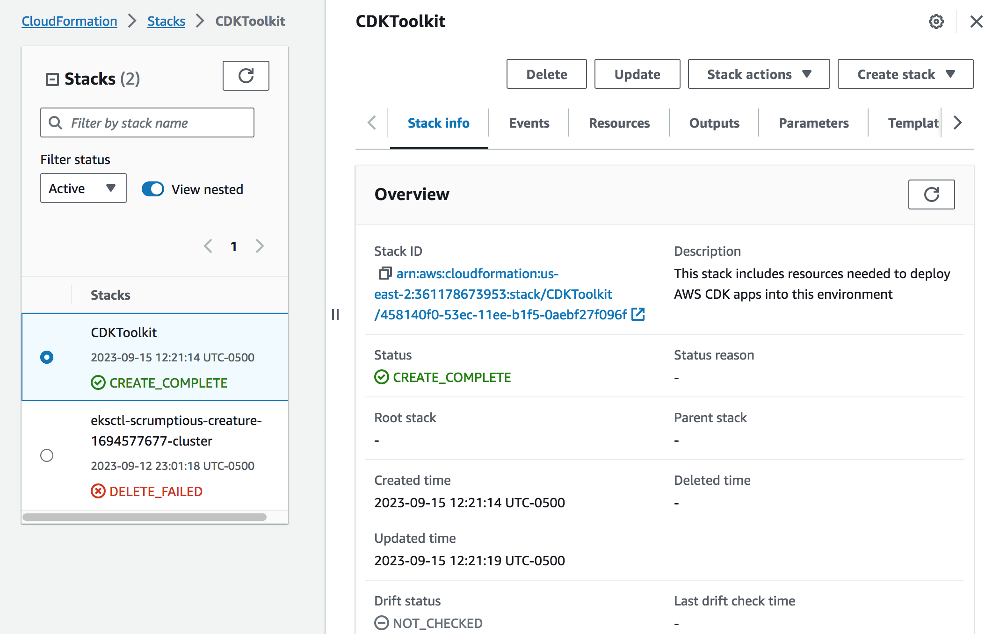

- VPC
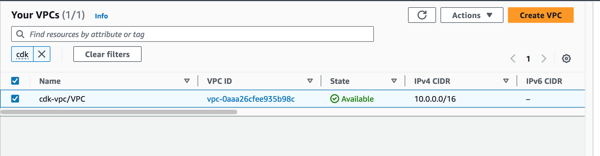

- Subnet
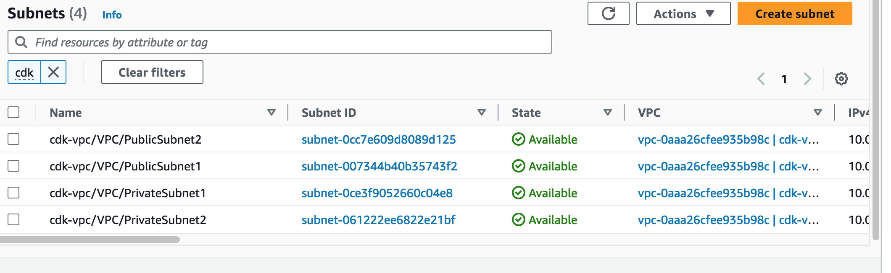

- Security Groups
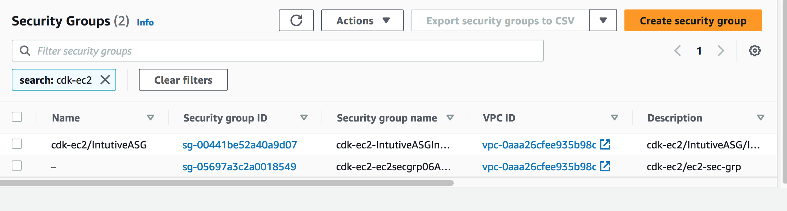

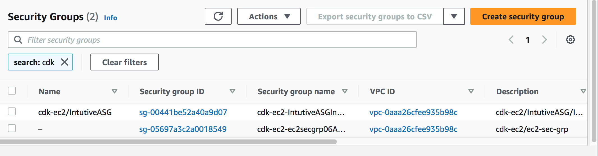

- Nacl's
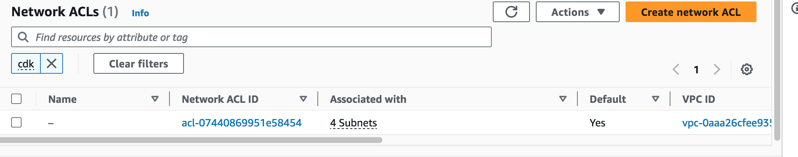

- Internet Gateway
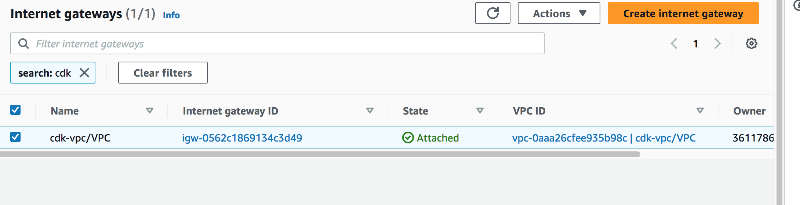

- Nat Gateway
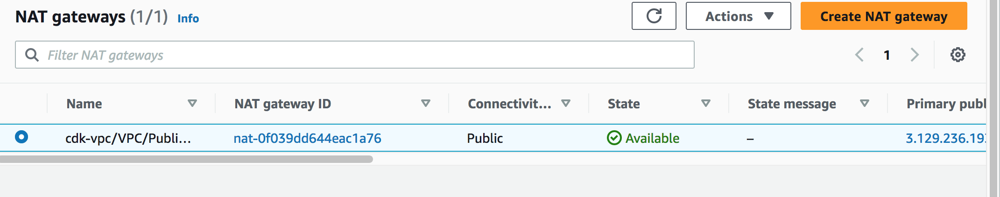

- Auto Scalling Group
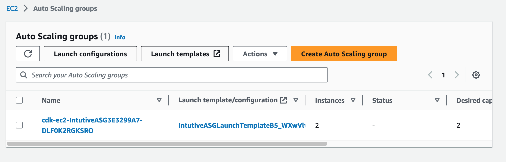

- Instances (backed by ASG).
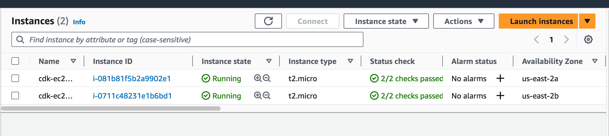

- S3 Bucket
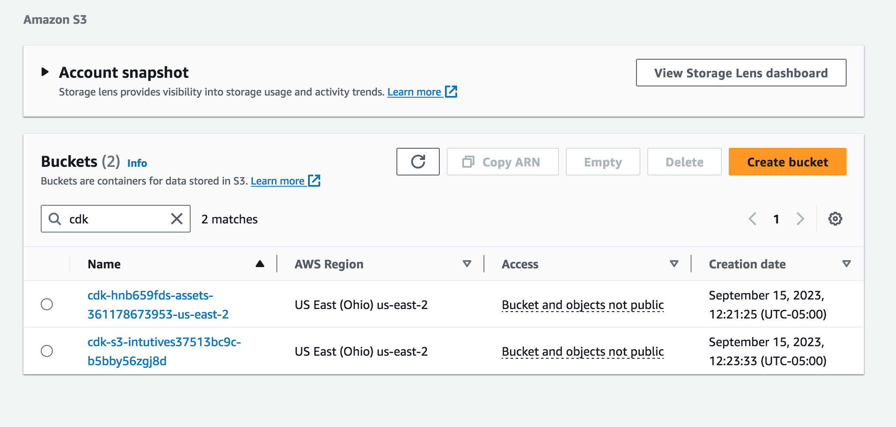


