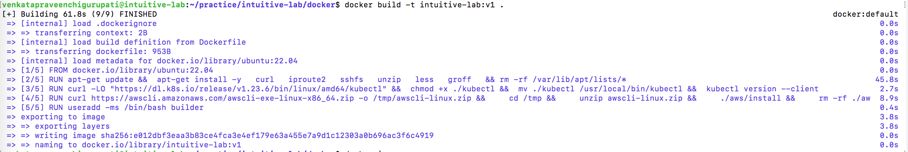
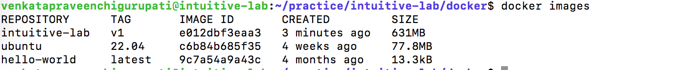
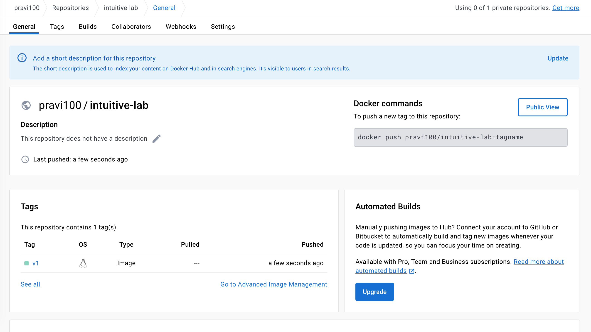

- Build the docker image locally
  

- List the docker images and take a screenshot.
  

- Using the image, create and start a container
  

- List running containers and take a screenshot
  

- Update README with commands to create image and create/start
  container, as well as command that would be used to upload image
  to DockerHub registry.
  
