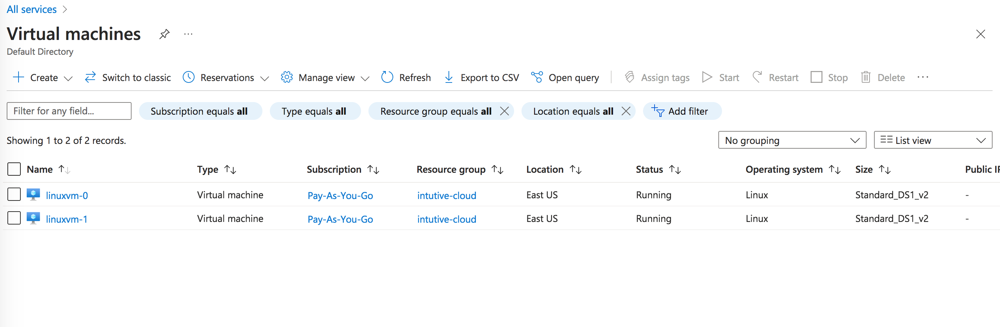
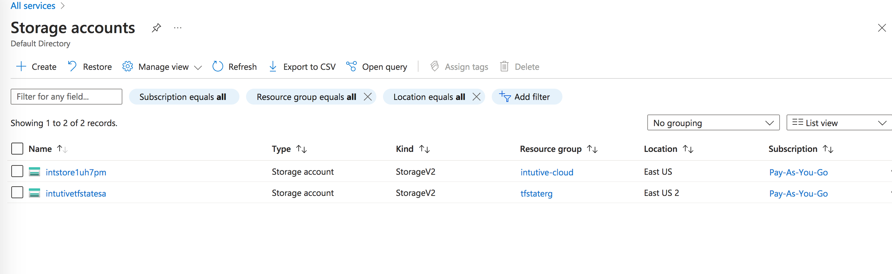
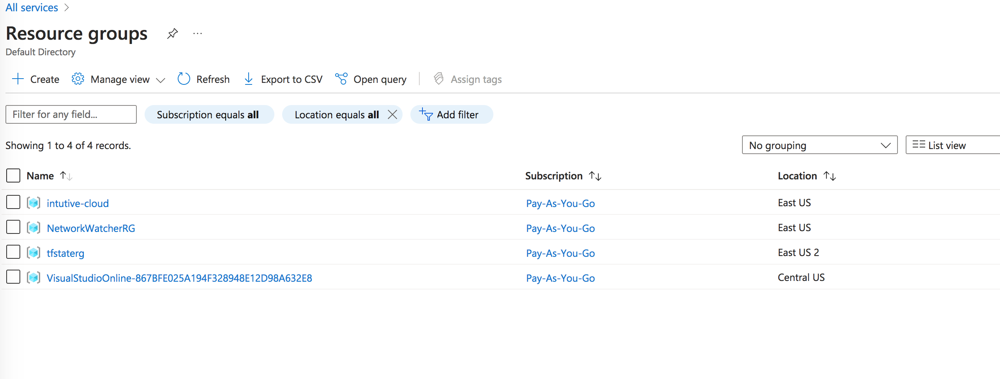
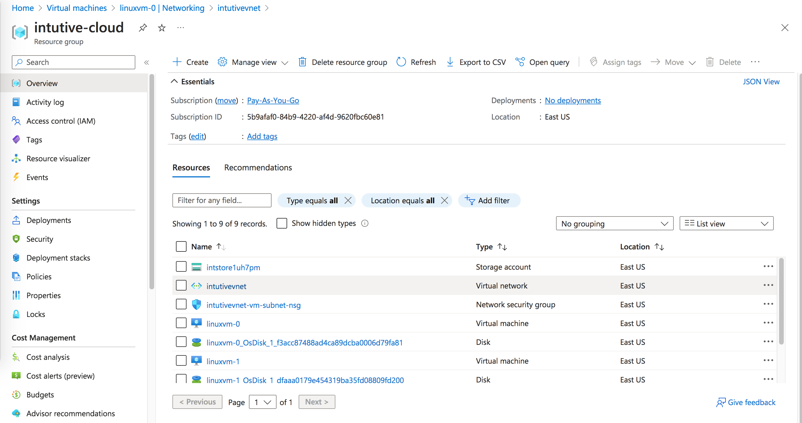
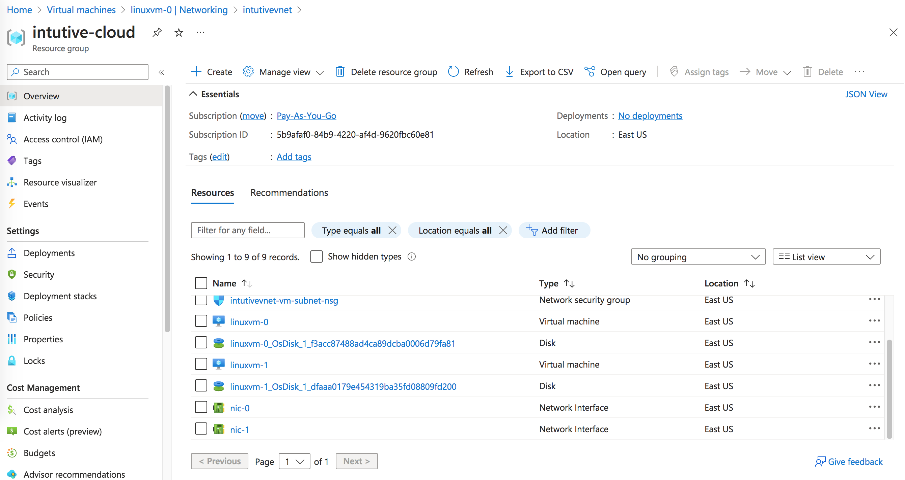
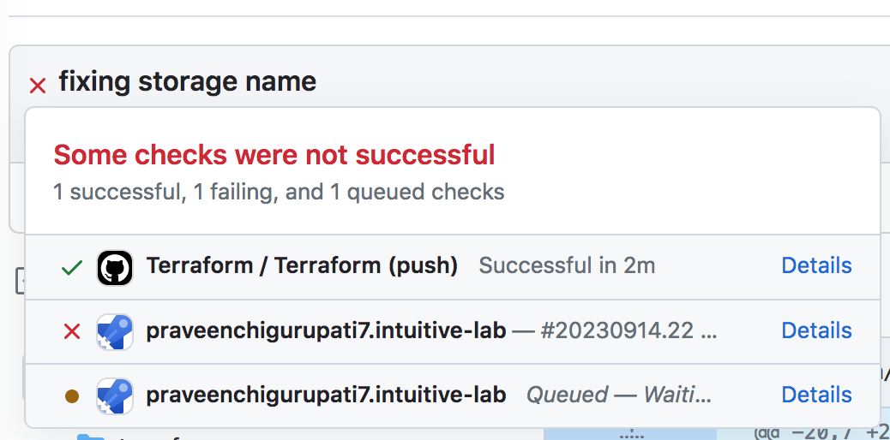
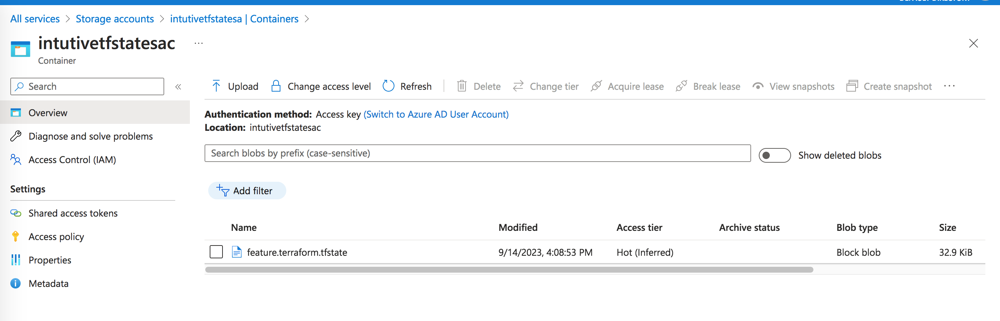

As suggested in the [Lab Instruction](../instructions/lab_instruction.pdf) doc.

I have tried to use GitHub Actions and Azure pipeline to deploy an Azure based setup using Terraform as IaC.

Please find the details of Infrastructure below:

- Compute

- Storage

- Network

Hosted my code on my [Github repo](https://github.com/praveenchigurupati7/intuitive-lab) in a feature branch.

This setup auto triggers the Github actions build for every commit on branch "feature-branch" in "intuitive-lab" repo.

You can see the builds run for each change.

Along with this i have added a storage container in Azure to store the statefile.
